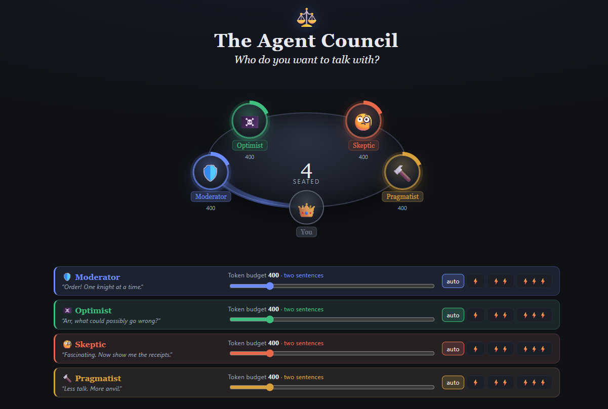

# 🏛️ AgentCouncil

Pick a topic, invite a few AI characters to a round table, and let them argue it out. When the talking is done, one of them rolls up their sleeves and **does the work**: plans a todo list, writes files, and asks for your approval before touching anything.

Built on the **Microsoft Agent Framework** (.NET) and **.NET Aspire**, backed by **Azure OpenAI**.

<p align="center">
  
</p>

## Meet the council

|     | Agent          | What they do                                                       |
| --- | -------------- | ------------------------------------------------------------------ |
| 🛡️  | **Moderator**  | Keeps the debate on track and passes the floor                     |
| 🏴‍☠️  | **Optimist**   | Sees the upside in everything                                      |
| 🧐  | **Skeptic**    | Pokes holes, and can read the files the council has written        |
| 🔨  | **Pragmatist** | Turns talk into a plan, then into files, with a Researcher on call |

## What you can do

- **Choose who sits at the table.** Invite any mix (at least two agents, one of them a persona).
- **Tune each agent.** A slider sets how long their turns are (150–1500 output tokens), and effort chips (`auto` / ⚡ / ⚡⚡ / ⚡⚡⚡) set reasoning depth.
- **Pick how they talk:**
  - **Handoff**: the Moderator decides who speaks next, and agents can hand the floor to each other.
  - **Group chat**: strict round-robin, for a set number of turns per agent.
- **Jump in anytime.** When they finish a round, the floor comes back to you.
- **Make it real.** Press the **🔨 act** button to hand it to the Pragmatist. It proposes todos (_plan_ mode), you confirm, and it executes: writing files to a shared workspace. Every write waits for **Approve / Always approve / Deny**.
- **Pick up where you left off.** Start a new council from any `.md` file in the workspace (e.g. a previous `decision-record.md`).
- **Watch it think.** Every agent turn and LLM call is traced in the Aspire dashboard, and the Agent Framework **DevUI** lets you talk to each agent directly.

## Getting started

### Prerequisites

- [.NET 10 SDK](https://dotnet.microsoft.com/download)
- An **Azure OpenAI** resource with at least one chat model deployment, plus its API key

### 1. Clone

```bash
git clone https://github.com/sa-es-ir/AgentCouncil.git
cd AgentCouncil
```

### 2. Add your Azure OpenAI connection string

Everything goes into one connection string, stored in the AppHost's user-secrets (never in source control):

```bash
dotnet user-secrets --project src/AgentCouncil.AppHost set "ConnectionStrings:openai" \
  "Endpoint=https://<resource>.openai.azure.com/;Key=<api-key>;Deployment=<deployment>;CheapDeployment=<optional-deployment>"
```

| Part              | Required | Used for                                                                                       |
| ----------------- | -------- | ---------------------------------------------------------------------------------------------- |
| `Endpoint`        | ✅       | Your Azure OpenAI resource URL                                                                 |
| `Key`             | ✅       | The resource's API key                                                                         |
| `Deployment`      | ✅       | Moderator and the Pragmatist (the harness)                                                     |
| `CheapDeployment` | optional | The personas, the Researcher and conversation summaries. Falls back to `Deployment` if omitted |

> 💡 Using a smaller model for `CheapDeployment` (e.g. a _mini_ model) cuts cost a lot, since the personas do most of the talking.

### 3. Run

```bash
dotnet run --project src/AgentCouncil.AppHost
```

The console prints the **Aspire dashboard** URL. Open it, wait until `agents` and `web` are healthy, then click the `web` endpoint.

## A first session

1. **Invite** the Optimist, the Skeptic and the Pragmatist. Watch them walk to the table.
2. Choose **Handoff** (the Moderator is seated automatically) or **Group chat**.
3. Drop a topic, e.g. _"Should we adopt a 4-day work week?"_, and let them debate.
4. When the floor returns to you, reply to steer the debate, or press the Pragmatist's **🔨 act** button with an instruction like _"write a decision record"_.
5. Review the proposed todos and hit **Confirm plan**.
6. **Approve** the first file write, then choose **Always approve** for the rest.
7. `decision-record.md` appears in the workspace pane. Click it to preview.
8. Ask the Skeptic to rebut the record. It can read it.

## DevUI (development only)

While running in Development, the `agents` service hosts the Agent Framework debugger at:

```
https://localhost:<agents-port>/devui
```

All four debaters are listed there. Chat with one directly and inspect its turns and traces. The full handoff graph is also available as Mermaid at `/council/graph`.

## Deploying to Azure

The repo is set up for the [Azure Developer CLI](https://learn.microsoft.com/azure/developer/azure-developer-cli/) and deploys to **Azure Container Apps**:

```bash
azd auth login
azd up
```

Before your first deploy:

- **Custom domain**: `src/AgentCouncil.AppHost/AppHost.cs` binds the `web` app to the author's domain. Remove the `ConfigureCustomDomain` call (and the `webDomain`/`webCertificate` parameters), or point them at your own.
- **Connection string**: `azd` prompts for the `openai` connection string. Use the same format as above.
- **Workspace files are temporary**: in Azure the workspace lives in `/tmp`, so files disappear when the container restarts. Mount an Azure Files volume if you want to keep them.
- **One replica only**: sessions live in memory, so each app is pinned to a single replica.

## Good to know

- The **workspace** (`src/AgentCouncil.Agents/workspace/`) is shared by everyone connected to the same server, and is git-ignored.
- If your deployment is **not a reasoning model**, leave effort on `auto`. The other settings send a reasoning parameter that non-reasoning models reject.
- Closing the browser tab ends your session and stops any background Researcher work.
- Skills for the Skeptic live in `src/AgentCouncil.Agents/skills/` as `SKILL.md` files. Add your own folder to give it new tricks.

## Project layout

```
src/AgentCouncil.AppHost          Aspire orchestration (entry point, run this)
src/AgentCouncil.Agents           Agents, workflows, harness, SignalR hub, DevUI
src/AgentCouncil.Web              Blazor Server UI
src/AgentCouncil.ServiceDefaults  Shared telemetry and health checks
test/AgentCouncil.AppHost.Tests   Tests
docs/                             Deeper notes on the Agent Framework and the harness
```

## Build & test

```bash
dotnet build AgentCouncil.slnx
dotnet test  AgentCouncil.slnx
```

## Learn more

- [docs/AGENT-FRAMEWORK.md](docs/AGENT-FRAMEWORK.md): how the debaters and workflows are built
- [docs/AGENT-HARNESS.md](docs/AGENT-HARNESS.md): how the Pragmatist plans, loops, and asks for approval
- [CLAUDE.md](CLAUDE.md): architecture details and known gotchas for contributors
